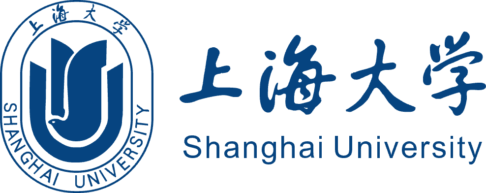



📌(Updating❗) My latest CV can be downloaded [here](https://jxing0831.github.io/files/jiexing0928.pdf) (09.28).

<!-- 
<embed src="https://jxing0831.github.io/files/jiexing0928.pdf" type="application/pdf" width="100%" />
--> 

***Information and Computing Sciences, College of Science, Shanghai University***

E-Mail👇

- [jxing0831@qq.com](mailto:jxing0831@qq.com)
- [jxing0831@sjtu.edu.cn](mailto:jxing0831@sjtu.edu.cn)
- [18152106379@shu.edu.cn](mailto:18152106379@shu.edu.cn)

✒ **`@jxing0831`** is my personal ID, you can find me anywhere :D

---

Education
------

        <strong> 📕Shanghai Jiao Tong University, China  </strong>(Feb. 2022 - Jun. 2024)
           
        <ul>
        <i>
          Wise Information Technology of Medical (Minor)</i>
      </ul>      
      

 

        <strong> 📘Shanghai University, China  </strong>(Sep. 2020 - Jun. 2024)(Expected)
           
        <ul>
        <i>
          Bachelor of Science, Information and Computing Sciences<i>
      </ul>      
      

---

## Experience

### Mathematical Contest in Modeling

- *2022 Mathematical Contest in Modeling, MCM/ICM* 
  - Used the Logistics model to simulate the growth of forest area and the time series model to predict the forest area after ten years of the model to provide forest managers with optimal management plans. 
  
  - Article Harvest or Conserve? A Forest Management Plan Based on Multiple Dynamic Strategy was awarded **Honorable Mention**, top **21%**. 
  
- *2022 Shanghai University Mathematical Contest in Modeling* 
  - Improved and optimized SEIR epidemic model for healthcare in Shanghai. And forecast the development of epidemic situation and put forward suggestions for economic development. 
  - The article won the first place in Shanghai University, **top 1/50**. 

- *2022 China Undergraduate Mathematical Contest in CUMCM* 
  - Built a PCA model for data dimensionality reduction and used the Fisher Linear Discriminant to classify samples and judge the type.

    <strong> Team SRM, Shanghai University  </strong>(Sep. 2021 - Aug. 2022)
            
          </a> 
        <ul>
        <i>
          As a member of SHU Robomaster Team SRM, I assisted in development of the *standard* robot and the assembly.</i>
      </ul>      
      

### Med-X Innovation Program, Shanghai Jiao Tong University

Based on the patient’s functional magnetic resonance data (fMRI), extract feature information and build a **machine learning** model to mine biomarkers that are highly correlated with sleep and Atypical Depression subtypes.

---

## Skills

* $LaTeX$

* CET-6

* ……

## Publications
* Updating~

## Talks
* Updating~

## Teaching
* Updating~

## Service and leadership
* Updating~
